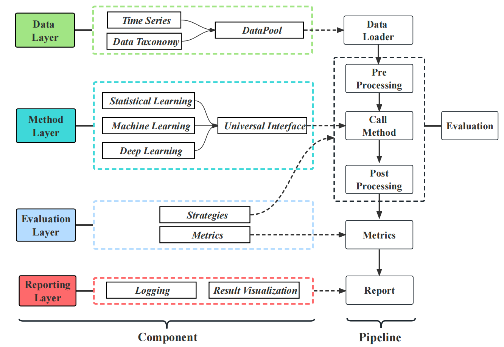

<div align="center">

</div>


[](https://arxiv.org/pdf/2403.20150.pdf)  [](https://www.python.org/)  [](https://pytorch.org/)    [](https://badges.pufler.dev/visits/decisionintelligence/TFB)

# TFB: Towards Comprehensive and Fair Benchmarking of Time Series Forecasting Methods

**We are further optimizing our code and welcome any suggestions for modifications.**

🚩 **News** (2024.09) **You can find detailed API documentation [here](https://tfb-docs.readthedocs.io/en/latest/index.html)**. 

🚩 **News** (2024.08) **Introduction video (in Chinese): [bilibili](https://www.bilibili.com/video/BV1fYH4eQEPv/?spm_id_from=333.337.search-card.all.click).**

🚩 **News** (2024.08) **TFB achieves 🌟Best Paper Nomination🌟 in PVLDB 2024**.

🚩 **News** (2024.08) **We have created a leaderboard for time series forecasting，called [OpenTS](https://decisionintelligence.github.io/OpenTS/).**

🚩 **News** (2024.05) **Some introduction (in Chinese): [intro1](https://mp.weixin.qq.com/s/5BscuAWIn-tzla2rzW1IsQ), [intro2](https://mp.weixin.qq.com/s/IPY2QwJ68YIrclMi2JtkMA), [intro3](https://mp.weixin.qq.com/s/D4SBwwVjHvuksaQ0boXjNw), [intro4](https://mp.weixin.qq.com/s/OfZJtd3H3-TCkvBGATt0mA), [intro5](https://mp.weixin.qq.com/s/pjTN15vHL5UxjL1mhJxguw), [intro6](https://mp.weixin.qq.com/s/ghJ3xN38pB-sDb0hiWjW7w).**

## Table of Contents

1. [Introduction](#introduction)
1. [Quickstart](#Quickstart)
1. [Steps to develop your own method](#Steps-to-develop-your-own-method)
1. [Steps to evaluate on your own time series](#Steps-to-evaluate-on-your-own-time-series)
1. [FAQ](#FAQ)
1. [Citation](#Citation)
1. [Acknowledgement](#Acknowledgement)
1. [Contact](#Contact)


## Introduction

TFB is an open-source library designed for time series forecasting researchers.

We provide a clean codebase for end-to-end evaluation of time series forecasting models, comparing their performance with baseline algorithms under various evaluation strategies and metrics.

The below figure provides a visual overview of TFB's pipeline.

<div align="center">

</div>


The table below provides a visual overview of how TFB's key features compare to other libraries for time series forecasting.


## Quickstart

### Installation

#### From PyPI

Given a python environment (**note**: this project is fully tested under **python 3.8**), install the dependencies with the following command:

```shell
pip install -r requirements.txt
```

#### From Docker

We also provide a [Dockerfile](https://github.com/decisionintelligence/TFB/blob/master/Dockerfile) for you. For this setup to work you need to have a Docker service installed. You can get it at [Docker website](https://docs.docker.com/get-docker/).

```shell
docker build . -t tfb:latest
```

```shell
docker run -it -v $(pwd)/:/app/ tfb:latest bash
```

### Data preparation

You can obtained the well pre-processed datasets from [Google Drive](https://drive.google.com/file/d/1vgpOmAygokoUt235piWKUjfwao6KwLv7/view?usp=drive_link). Then place the downloaded data under the folder `./dataset`. 

### Train and evaluate model

We provide the experiment scripts for all benchmarks under the folder `./scripts/multivariate_forecast`, and `./scripts/univariate_forecast`. For example you can reproduce a experiment result as the following:

```shell
sh ./scripts/multivariate_forecast/ILI_script/DLinear.sh
```

## Steps to develop your own method
We provide tutorial about how to develop your own method, you can [click here](./docs/tutorials/steps_to_develop_your_own_method.md).


## Steps to evaluate on your own time series
We provide tutorial about how to evaluate on your own time series, you can [click here](./docs/tutorials/steps_to_evaluate_your_own_time_series.md).


## FAQ

### How to use Pycharm to run code？

When running under pycharm，please escape the double quotes, remove the spaces, and remove the single quotes at the beginning and end.

Such as: **'{"d_ff": 512, "d_model": 256, "horizon": 24}' ---> {\\"d_ff\\":512,\\"d_model\\":256,\\"horizon\\":24}**

```shell
--config-path "rolling_forecast_config.json" --data-name-list "ILI.csv" --strategy-args {\"horizon\":24} --model-name "time_series_library.DLinear" --model-hyper-params {\"batch_size\":16,\"d_ff\":512,\"d_model\":256,\"lr\":0.01,\"horizon\":24,\"seq_len\":104} --adapter "transformer_adapter"  --gpus 0  --num-workers 1  --timeout 60000  --save-path "ILI/DLinear"
```


## Citation

If you find this repo useful, please cite our paper.

```
@article{qiu2024tfb,
  title   = {TFB: Towards Comprehensive and Fair Benchmarking of Time Series Forecasting Methods},
  author  = {Xiangfei Qiu and Jilin Hu and Lekui Zhou and Xingjian Wu and Junyang Du and Buang Zhang and Chenjuan Guo and Aoying Zhou and Christian S. Jensen and Zhenli Sheng and Bin Yang},
  journal = {Proc. {VLDB} Endow.},
  volume  = {17},
  number  = {9},
  pages   = {2363--2377},
  year    = {2024}
}
```


## Acknowledgement

The development of this library has been supported by **Huawei Cloud**, and we would like to acknowledge their contribution and assistance.


## Contact

If you have any questions or suggestions, feel free to contact:

- Xiangfei Qiu (xfqiu@stu.ecnu.edu.cn)
- Xingjian Wu (xjwu@stu.ecnu.edu.cn)


Or describe it in Issues.
