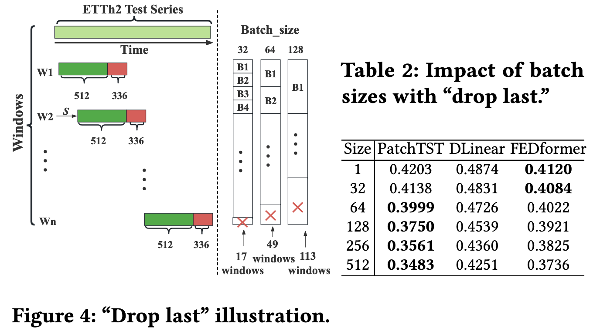

<div align="center">

</div>


[](https://arxiv.org/pdf/2403.20150.pdf)  [](https://www.python.org/)  [](https://pytorch.org/)    [](https://badges.pufler.dev/visits/decisionintelligence/TFB)

# TFB: Towards Comprehensive and Fair Benchmarking of Time Series Forecasting Methods


> [!IMPORTANT]
> 1、If you find this project helpful, please don't forget to give it a ⭐ Star to show your support. Thank you!
> 
> 2、We have retested the results of some algorithms, which may differ from those in the TFB paper. You can find the hyperparameters we ultimately selected for each algorithm on each dataset in the [scripts](https://github.com/decisionintelligence/TFB/tree/master/scripts) folder, and their corresponding algorithm test results can be found on the [OpenTS](https://decisionintelligence.github.io/OpenTS/leaderboards/multivariate_time_series/)!

🚩 **News** (2025.03) **TFB has added a [new practical feature](./docs/tutorials/steps_to_predict_only_a_subset_of_input_variables.md): support for predicting only a subset of input variables**.

🚩 **News** (2025.03) **We maintain a [WeChat group](./docs/figures/QR.png) to facilitate discussions about TFB and [OpenTS](https://decisionintelligence.github.io/OpenTS/)**.

🚩 **News** (2024.09) **You can find detailed API documentation [here](https://tfb-docs.readthedocs.io/en/latest/index.html)**. 

🚩 **News** (2024.08) **Introduction video (in Chinese): [bilibili](https://www.bilibili.com/video/BV1fYH4eQEPv/?spm_id_from=333.337.search-card.all.click).**

🚩 **News** (2024.08) **TFB achieves 🌟Best Paper Nomination🌟 in PVLDB 2024**.

🚩 **News** (2024.08) **We have created a leaderboard for time series forecasting，called [OpenTS](https://decisionintelligence.github.io/OpenTS/).**

🚩 **News** (2024.05) **Some introduction (in Chinese): [intro1](https://mp.weixin.qq.com/s/5BscuAWIn-tzla2rzW1IsQ), [intro2](https://mp.weixin.qq.com/s/IPY2QwJ68YIrclMi2JtkMA), [intro3](https://mp.weixin.qq.com/s/D4SBwwVjHvuksaQ0boXjNw), [intro4](https://mp.weixin.qq.com/s/OfZJtd3H3-TCkvBGATt0mA), [intro5](https://mp.weixin.qq.com/s/pjTN15vHL5UxjL1mhJxguw), [intro6](https://mp.weixin.qq.com/s/ghJ3xN38pB-sDb0hiWjW7w), and [intro7](https://mp.weixin.qq.com/s/J8SRsN4W0FNMtlLpULhwKg).**


**Newly added baselines.** ☑ means that their codes have already been included into this repo, and their performance results have been included in the  [OpenTS](https://decisionintelligence.github.io/OpenTS/) leaderboard. ☒ means that just their codes have already been included into this repo.
  - [ ] **PatchMLP** - PatchMLP: Unlocking the Power of Patch: Patch-Based MLP for Long-Term Time Series Forecasting [[AAAI 2025]](https://arxiv.org/pdf/2405.13575), [[Code]](https://github.com/decisionintelligence/TFB/tree/master/ts_benchmark/baselines/patchmlp).
     
  - [ ] **Amplifier** - Amplifier: Bringing Attention to Neglected Low-Energy Components in Time Series Forecasting [[AAAI 2025]](https://arxiv.org/pdf/2501.17216), [[Code]](https://github.com/decisionintelligence/TFB/tree/master/ts_benchmark/baselines/amplifier).
    
  - [x] **DUET** - DUET: Dual Clustering Enhanced Multivariate Time Series Forecasting [[KDD 2025]](https://arxiv.org/pdf/2412.10859), [[Code]](https://github.com/decisionintelligence/TFB/tree/master/ts_benchmark/baselines/duet).

  - [x] **PDF** - Periodicity Decoupling Framework for Long-term Series Forecasting [[ICLR 2024]](https://openreview.net/pdf?id=dp27P5HBBt), [[Code]](https://github.com/decisionintelligence/TFB/tree/master/ts_benchmark/baselines/pdf).

  - [x] **Pathformer** - Pathformer: Multi-scale transformers with adaptive pathways for time series forecasting [[ICLR 2024]](https://arxiv.org/pdf/2402.05956), [[Code]](https://github.com/decisionintelligence/TFB/tree/master/ts_benchmark/baselines/pathformer).

  - [x] **FITS** - FITS: Modeling Time Series with 10k Parameters [[ICLR 2024]](https://arxiv.org/pdf/2307.03756), [[Code]](https://github.com/decisionintelligence/TFB/tree/master/ts_benchmark/baselines/fits).

    

## Table of Contents

1. [Introduction](#introduction)
1. [Quickstart](#Quickstart)
1. [Steps to develop your own method](#Steps-to-develop-your-own-method)
1. [Steps to evaluate on your own time series](#Steps-to-evaluate-on-your-own-time-series)
1. [Time series code bug the drop-last illustration](#Time-series-code-bug-the-drop-last-illustration)
1. [FAQ](#FAQ)
1. [Citation](#Citation)
1. [Acknowledgement](#Acknowledgement)
1. [Contact](#Contact)


## Introduction

TFB is an open-source library designed for time series forecasting researchers.

We provide a clean codebase for end-to-end evaluation of time series forecasting models, comparing their performance with baseline algorithms under various evaluation strategies and metrics.

The below figure provides a visual overview of TFB's pipeline.

<div align="center">

</div>


The table below provides a visual overview of how TFB's key features compare to other libraries for time series forecasting.


## Quickstart
> [!IMPORTANT]
> this project is fully tested under python 3.8, it is recommended that you set the Python version to 3.8.
1. Installation:

- From PyPI

Given a python environment (**note**: this project is fully tested under **python 3.8**), install the dependencies with the following command:

```shell
pip install -r requirements.txt
```

> [!IMPORTANT]
> If you want to reproduce the results from [scripts](https://github.com/decisionintelligence/TFB/tree/master/scripts), please use the `requirements-docker.txt` file instead of `requirements.txt`. This is because `requirements-docker.txt` locks the versions of the packages, while `requirements.txt` provides version ranges, which may result in different dependency versions and affect the accuracy of the reproduction. 
> ```shell
> pip install -r requirements-docker.txt
> ```

- From Docker

We also provide a [Dockerfile](https://github.com/decisionintelligence/TFB/blob/master/Dockerfile) for you. For this setup to work you need to have a Docker service installed. You can get it at [Docker website](https://docs.docker.com/get-docker/).

```shell
docker build . -t tfb:latest
```

```shell
docker run -it -v $(pwd)/:/app/ tfb:latest bash
```

2. Data preparation:

You can obtained the well pre-processed datasets from [Google Drive](https://drive.google.com/file/d/1vgpOmAygokoUt235piWKUjfwao6KwLv7/view?usp=drive_link) or [Baidu Drive](https://pan.baidu.com/s/1ycq7ufOD2eFOjDkjr0BfSg?pwd=bpry). Then place the downloaded data under the folder `./dataset`. 

3. Train and evaluate model:

We provide the experiment scripts for all benchmarks under the folder `./scripts/multivariate_forecast`, and `./scripts/univariate_forecast`. For example you can reproduce a experiment result as the following:

```shell
sh ./scripts/multivariate_forecast/ILI_script/DLinear.sh
```

## Steps to develop your own method
We provide tutorial about how to develop your own method, you can [click here](./docs/tutorials/steps_to_develop_your_own_method.md).


## Steps to evaluate on your own time series
We provide tutorial about how to evaluate on your own time series, you can [click here](./docs/tutorials/steps_to_evaluate_your_own_time_series.md).

## Time series code bug the drop-last illustration
Implementations of existing methods often  employ a `Drop Last trick in the testing phase`. To accelerate the testing, it is common to split the data into batches. However, if we discard the last incomplete batch with fewer instances than the batch size, this causes unfair comparisons. For example, in Figure 4, the ETTh2 has a testing series of length 2,880, and we need to predict 336 future time steps using a look-back window of size 512. If we select the batch sizes to be 32, 64, and 128, the number of samples in the last batch are 17, 49, and 113, respectively. **Unless all methods use the same batch size, discarding the last batch of test samples is unfair, as the actual usage length of the test set is inconsistent.** Table 2 shows the testing results of PatchTST, DLinear, and FEDformer on the ETTh2 with different batch sizes and the “Drop Last” trick turned on. **We observe that the performance of the methods changes when varying the batch size.**

**Therefore, TFB calls for the testing process to avoid using the drop-last operation to ensure fairness, and TFB did not use the drop-last operation during testing either.**
<div align="center">

</div>

## FAQ

1. How to use Pycharm to run code？

When running under pycharm，please escape the double quotes, remove the spaces, and remove the single quotes at the beginning and end.

Such as: **'{"d_ff": 512, "d_model": 256, "horizon": 24}' ---> {\\"d_ff\\":512,\\"d_model\\":256,\\"horizon\\":24}**

```shell
--config-path "rolling_forecast_config.json" --data-name-list "ILI.csv" --strategy-args {\"horizon\":24} --model-name "time_series_library.DLinear" --model-hyper-params {\"batch_size\":16,\"d_ff\":512,\"d_model\":256,\"lr\":0.01,\"horizon\":24,\"seq_len\":104} --adapter "transformer_adapter"  --gpus 0  --num-workers 1  --timeout 60000  --save-path "ILI/DLinear"
```

2. How to get models' predicted values and the target values？

We provide tutorial about how to get the models' predicted values and the target values, you can [click here](./docs/tutorials/steps_to_get_predict_and_actual_data.md).

3. Examples of script writing.

If you want to run datasets in parallel, test multiple datasets, or test multiple algorithms, and so on, you can [click here](./docs/tutorials/other_usage.sh).

4. How long the look-back window is used for the multivariate forecasting evaluation results?
   
You can find answer [here](https://github.com/decisionintelligence/TFB/issues/40).

5. How to train models with multiple gpus using DataParallel?
  
You can find answer [here](./docs/tutorials/steps_to_train_models_with_multi_gpus_using_dp.md).

6. How to predict only a subset of input variables?
   
You can find answer [here](./docs/tutorials/steps_to_predict_only_a_subset_of_input_variables.md).

## Citation

If you find this repo useful, please cite our paper.

```
@article{qiu2024tfb,
  title   = {TFB: Towards Comprehensive and Fair Benchmarking of Time Series Forecasting Methods},
  author  = {Xiangfei Qiu and Jilin Hu and Lekui Zhou and Xingjian Wu and Junyang Du and Buang Zhang and Chenjuan Guo and Aoying Zhou and Christian S. Jensen and Zhenli Sheng and Bin Yang},
  journal = {Proc. {VLDB} Endow.},
  volume  = {17},
  number  = {9},
  pages   = {2363--2377},
  year    = {2024}
}

@inproceedings{qiu2025duet,
  title     = {DUET: Dual Clustering Enhanced Multivariate Time Series Forecasting},
  author    = {Xiangfei Qiu and Xingjian Wu and Yan Lin and Chenjuan Guo and Jilin Hu and Bin Yang},
  booktitle = {SIGKDD},
  year      = {2025}
}
```


## Acknowledgement

The development of this library has been supported by **Huawei Cloud**, and we would like to acknowledge their contribution and assistance.


## Contact

If you have any questions or suggestions, feel free to contact:

- [Xiangfei Qiu](https://qiu69.github.io/) (xfqiu@stu.ecnu.edu.cn)
- Xingjian Wu (xjwu@stu.ecnu.edu.cn)


Or describe it in Issues.

We invite you to join the OpenTS community on WeChat. We run a group chat on WeChat, and you can get the access by scanning the [QR code](./docs/figures/QR.png). By joining the community, you can get the latest updates on OpenTS, share your ideas, and discuss with other members.

Those who wish to join can first scan the [QR code](./docs/figures/QR.png) to contact me via WeChat. Please **include your name and research direction in the remarks** when adding me. After your application is approved, we will invite you to join the group. Once you are in the group, please update your group nickname to **"Name + School/Institution + Research Direction."** Members who fail to update their remarks within a week will be regularly removed by the administrator.
