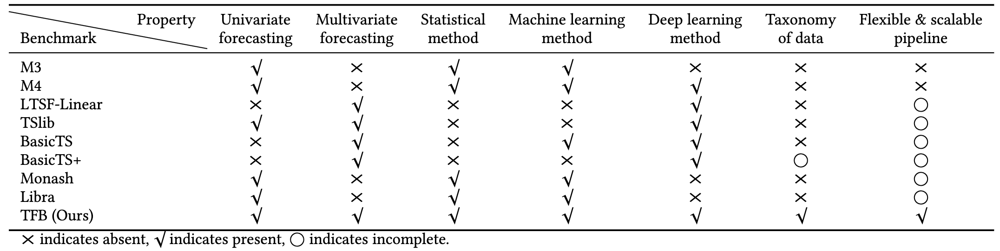

<div align="center">

</div>


[](https://arxiv.org/pdf/2403.20150.pdf)  [](https://www.python.org/)  [](https://pytorch.org/)    [](https://badges.pufler.dev/visits/decisionintelligence/TFB)

# TFB: Towards Comprehensive and Fair Benchmarking of Time Series Forecasting Methods

**We have created a leaderboard for time series forecasting, which can be accessed by clicking https://decisionintelligence.github.io/TFB_leaderboard/.**

**We are further optimizing our code and welcome any suggestions for modifications.**

## Table of Contents

1. [Introduction](#introduction)
1. [Quickstart](#Quickstart)
1. [Steps to develop your own method](#Steps-to-develop-your-own-method)
1. [FAQ](#FAQ)
1. [Citation](#Citation)
1. [Acknowledgement](#Acknowledgement)
1. [Contact](#Contact)

## Introduction

TFB is an open-source library designed for time series forecasting researchers.

We provide a clean codebase for end-to-end evaluation of time series forecasting models, comparing their performance with baseline algorithms under various evaluation strategies and metrics.

The below figure provides a visual overview of TFB's pipeline.

<div align="center">

</div>


The table below provides a visual overview of how TFB's key features compare to other libraries for time series forecasting.



## Quickstart

### Installation

#### From PyPI

Given a python environment (**note**: this project is fully tested under **python 3.8**), install the dependencies with the following command:

```shell
pip install -r requirements.txt
```

#### From Docker

We also provide a [Dockerfile](https://github.com/decisionintelligence/TFB/blob/master/Dockerfile) for you. For this setup to work you need to have a Docker service installed. You can get it at [Docker website](https://docs.docker.com/get-docker/).

```shell
docker build . -t tfb:latest
```

```shell
docker run -it -v $(pwd)/:/app/ tfb:latest bash
```

### Data preparation

You can obtained the well pre-processed datasets from [Google Drive](https://drive.google.com/file/d/1oq5sX_FLc3mkjzd0dt27q_5EqxRKbgDS/view?usp=drive_link). Then place the downloaded data under the folder `./dataset`. 

### Train and evaluate model

We provide the experiment scripts for all benchmarks under the folder `./scripts/multivariate_forecast`, and `./scripts/univariate_forecast`. For example you can reproduce a experiment result as the following:

```shell
sh ./scripts/multivariate_forecast/ILI_script/DLinear.sh
```

## Steps to develop your own method

### Define you model or adapter class

The user-implemented model or adapter class should implement the following functions in order to adapt to this benchmark.

"required_hyper_params" function is optional，__repr__ functions is necessary.

**The function prototypes are as follows：**

- required_hyper_params  function:

  ```python
  """
  Return the hyperparameters required by the model
  This function is optional and static
  
  :return: A dictionary that represents the hyperparameters required by the model
  :rtype: dict
  """
  # For example
  @staticmethod
  def required_hyper_params() -> dict:
      """
      An empty dictionary indicating that model does not require
      additional hyperparameters.
      """
      return {}
  ```

- forecast_fit  function training model

  ```python
  """
  Train the model.
  
  :param train_data: Time series data used for training.
  :param train_ratio_in_tv: Represents the splitting ratio of the training
  set validation set. If it is equal to 1, it means that the validation
  set is not partitioned.
  """
  # For example
  def forecast_fit(self, train_data: pd.DataFrame, *, train_ratio_in_tv: float = 1.0, **kwargs) -> "ModelBase":
      pass
  ```
  
- forecast function utilizing the model for inference

  ```python
  """
  Use models for forecasting
  
  :param horizon: Predict length
  :type horizon: int
  :param series: Training data used to fit the model
  :type series: pd.DataFrame
  
  :return: Forecasting results
  :rtype: np.ndarray
  """
  # For example
  def forecast(self, horizon: int, series: pd.DataFrame, **kwargs) -> np.ndarray:
      pass
  ```

- __repr __ string representation of function model name

  ```python
  """
  Returns a string representation of the model name
  
  :return: Returns a string representation of the model name
  :rtype: str
  """
  # For example
  def __repr__(self) -> str:
      return self.model_name
  ```

### Configure your Configuration File

  - Modify the corresponding config under the folder `./config/`.

  - Modify the contents in  `./scripts/run_benchmark.py/`.

  - **We strongly recommend using the pre-defined configurations in `./config/`. Create your own  configuration file only when you have a clear understanding of the configuration items.**

### Run it

```shell
python ./scripts/run_benchmark.py --config-path "rolling_forecast_config.json" --data-name-list "ILI.csv" --strategy-args '{"horizon":24}' --model-name "time_series_library.DLinear" --model-hyper-params '{"batch_size": 16, "d_ff": 512, "d_model": 256, "lr": 0.01, "horizon": 24, "seq_len": 104}' --adapter "transformer_adapter"  --gpus 0  --num-workers 1  --timeout 60000  --save-path "ILI/DLinear"
```

## FAQ

### How to use Pycharm to run code？

When running under pycharm，please escape the double quotes, remove the spaces, and remove the single quotes at the beginning and end.

Such as: **'{"d_ff": 512, "d_model": 256, "horizon": 24}' ---> {\\"d_ff\\":512,\\"d_model\\":256,\\"horizon\\":24}**

```shell
--config-path "rolling_forecast_config.json" --data-name-list "ILI.csv" --strategy-args {\"horizon\":24} --model-name "time_series_library.DLinear" --model-hyper-params {\"batch_size\":16,\"d_ff\":512,\"d_model\":256,\"lr\":0.01,\"horizon\":24,\"seq_len\":104} --adapter "transformer_adapter"  --gpus 0  --num-workers 1  --timeout 60000  --save-path "ILI/DLinear"
```

## Citation

If you find this repo useful, please cite our paper.

```
@article{qiu2024tfb,
  title   = {TFB: Towards Comprehensive and Fair Benchmarking of Time Series Forecasting Methods},
  author  = {Qiu, Xiangfei and Hu, Jilin and Zhou, Lekui and Wu, Xingjian and Du, Junyang and Zhang, Buang and Guo, Chenjuan and Zhou, Aoying and Jensen, Christian S and Sheng, Zhenli and Bin Yang},
  journal = {Proc. {VLDB} Endow.},
  year    = {2024}
  pages   = {2363 - 2377}
  volume  = {17}
}
```


## Acknowledgement

The development of this library has been supported by **Huawei Cloud**, and we would like to acknowledge their contribution and assistance.


## Contact

If you have any questions or suggestions, feel free to contact:

- Xiangfei Qiu (xfqiu@stu.ecnu.edu.cn)
- Xingjian Wu (xjwu@stu.ecnu.edu.cn)
- Buang Zhang (buazhang@stu.ecnu.edu.cn)
- Junyang Du (jydu818@stu.ecnu.edu.cn)


Or describe it in Issues.
