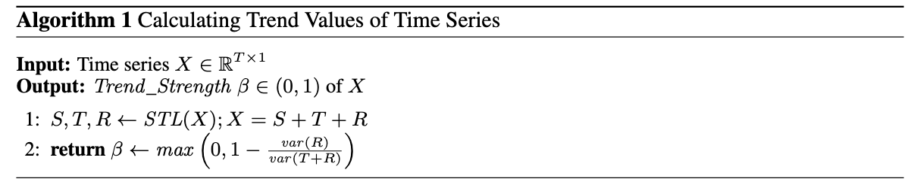
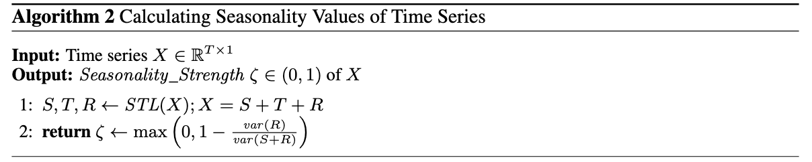
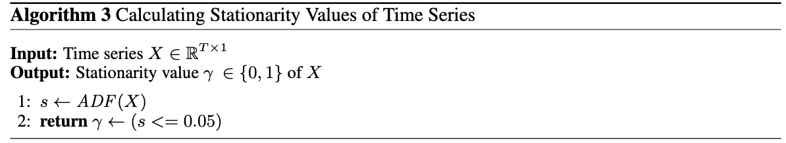
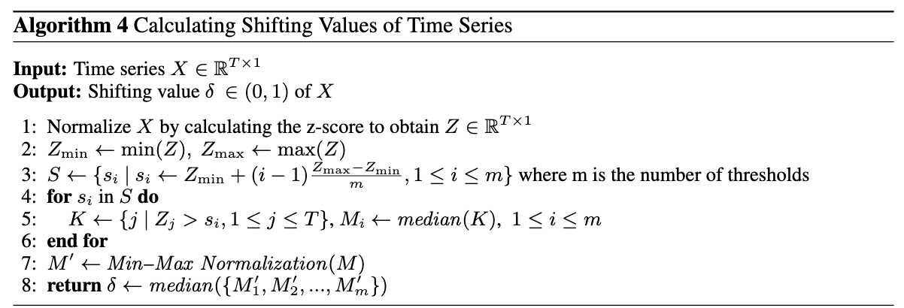
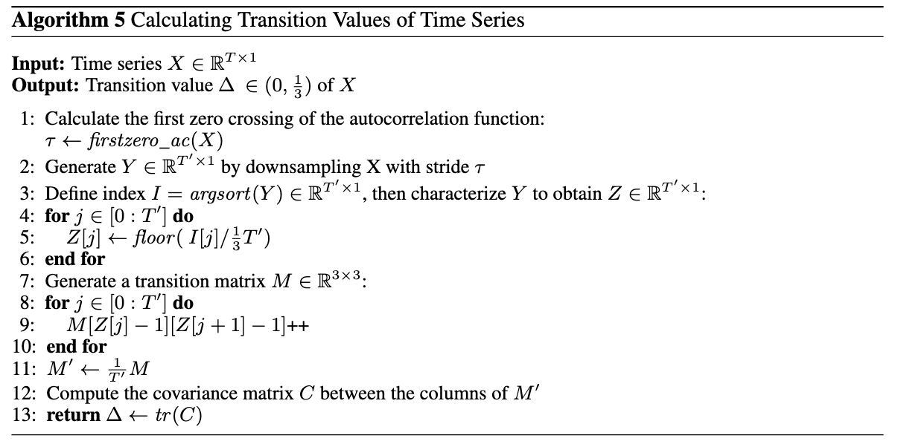
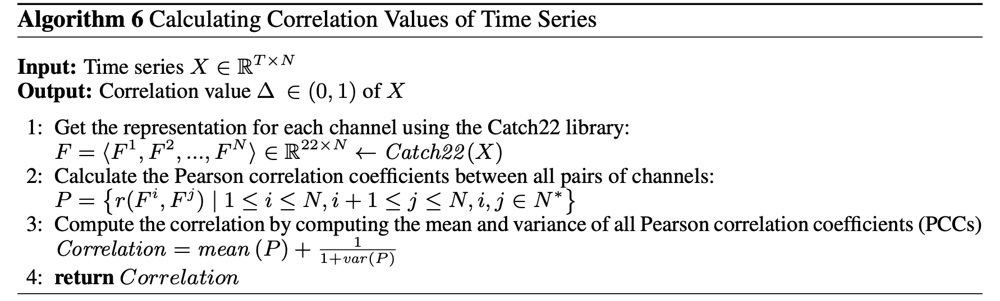
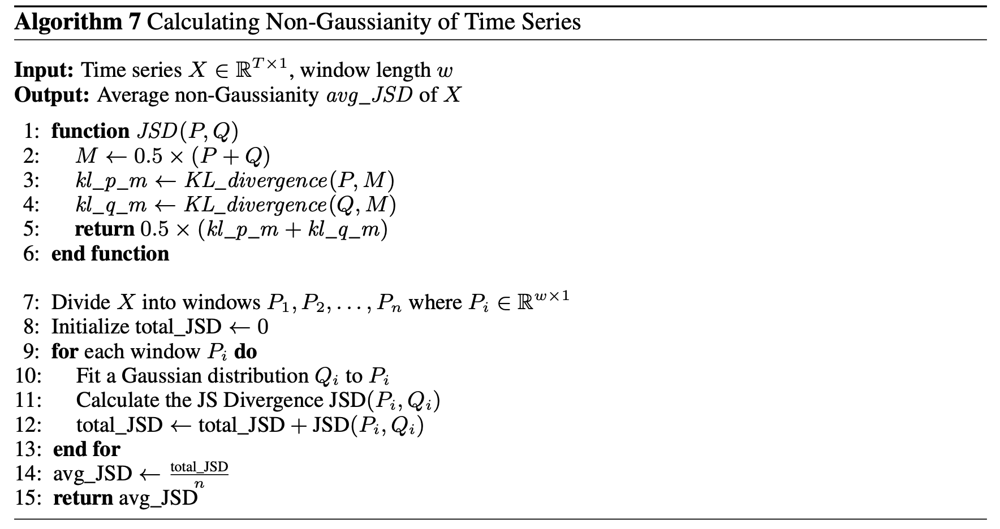

**Introduction and pseudocode for time series characteristics.**

 

## Trend:

The trend of a time series refers to the long-term changes or patterns that occur over time. Intuitively, it represents the general direction in which the data is moving. Referring to the explained variance, Trend Strength can be defined as in Algorithm 1. Seasonal and Trend decomposition using Loess (STL), which is a highly versatile and robust method for time series decomposition.

    

## Seasonality:

Seasonality refers to the phenomenon where changes in a time series repeat at specific intervals. Algorithm 2 details the calculation process.

    

## Stationarity:

Stationarity refers to the mean of any observation in a time series $X=\langle x_1,x_2,...,x_n\rangle$ is constant, and the variance is finite for all observations. Also, the covariance $\mathit{cov}(x_i,x_j)$ between any two observations $x_i$ and $x_j$ depends only on their distance $|j-i|$, i.e., $\forall i+r\leq n,j+r\leq n$ $(\mathit{cov}(x_i,x_j)=\mathit{cov}(x_{i+r},x_{j+r})).$ Strictly stationary time series are rare in practice. Therefore, weak stationarity conditions are commonly applied. In our paper, we also exclusively focus on weak stationarity.

    

## Shifting:

Shifting refers to the phenomenon where the probability distribution of time series changes over time. This behavior can stem from structural changes within the system, external influences, or the occurrence of random events. As the value approaches 1, the degree of shifting becomes more severe. Algorithm 4 details the calculation process.

    

## Transition:

Transition refers to the trace of the covariance of transition
matrix between symbols in a 3-letter alphabet. It captures the regular and identifiable fixed features present in a time series, such as the clear manifestation of trends, periodicity, or the simultaneous presence of both seasonality and trend. Algorithm 5 details the calculation process. 

    

## Correlation:

Correlation refers to the possibility that different variables in a multivariate time series may share common trends or patterns, indicating that they are influenced by similar factors or have some underlying relationship. Algorithm 6 details the calculation process. Catch22 is a library designed to extract 22 distinct features from time series data, facilitating comprehensive analysis and understanding of temporal patterns.

    

## Non-Gaussianity:

Non-Gaussianity complexity refers to the extent to which the distribution of values within a time series segment deviates from a Gaussian distribution, measuring the intricacy and variability of the data distribution. Algorithm 7 details the calculation process. **Short-term datasets used a window size of 30, while long-term datasets used a size of 336**. By averaging the calculated divergence values across all time-series segments of a dataset, we obtain a dataset-level measure of non-Gaussianity. A larger divergence value indicates a larger deviation from a Gaussian distribution in the data.

    

