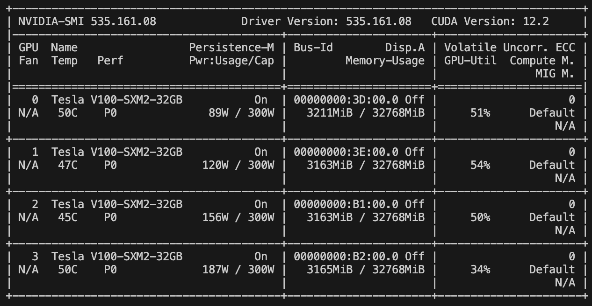

# Steps to train models with multiple gpus using DataParallel

If you are interested in training deep forecasting models in parallel using multiple GPUs, please follow the instructions below.

**Notes**: Currently, we only support **DataParallel**, and it is supported on both Sequential Backend and Ray Backend.


### 1. Check the GPU devices information on your machine
First and foremost, please ensure that there are multiple GPUs on your machine and that they are successfully detected. This can be accomplished in several ways:
1) Using nvidia-smi command
```
nvidia-smi
```
2) Using torch.cuda.device_count()
```
import torch
print(torch.cuda.device_count())
```

### 2. Configure the GPUs for Use via the `gpus` Argument
When initiating the running of the launching scripts, it is necessary to specify the GPUs to be utilized by setting the `gpus` argument.

```
python ./scripts/run_benchmark.py --config-path "rolling_forecast_config.json" --data-name-list "Electricity.csv" --strategy-args '{"horizon":96}' --model-name "time_series_library.PatchTST" --model-hyper-params '{"batch_size": 16, "d_ff": 1024, "d_model": 512, "lr": 0.001, "horizon": 96, "seq_len": 512}' --adapter "transformer_adapter"  --gpus 0  --num-workers 1  --timeout 60000  --save-path "Electricity/PatchTST"
```

Suppose there are 4 GPUs installed on your machine. If you wish to conduct the training process on specific GPUs, you can set it by providing the device IDs separated by spaces:

- To use 1 GPU (with ID 0):
```
python ./scripts/run_benchmark.py --config-path "rolling_forecast_config.json" --data-name-list "Electricity.csv" --strategy-args '{"horizon":96}' --model-name "time_series_library.PatchTST" --model-hyper-params '{"batch_size": 16, "d_ff": 1024, "d_model": 512, "lr": 0.001, "horizon": 96, "seq_len": 512}' --adapter "transformer_adapter"  --gpus 0  --num-workers 1  --timeout 60000  --save-path "Electricity/PatchTST"
```
- To use 2 GPUs (with IDs 0 and 2):
```
python ./scripts/run_benchmark.py --config-path "rolling_forecast_config.json" --data-name-list "Electricity.csv" --strategy-args '{"horizon":96}' --model-name "time_series_library.PatchTST" --model-hyper-params '{"batch_size": 16, "d_ff": 1024, "d_model": 512, "lr": 0.001, "horizon": 96, "seq_len": 512}' --adapter "transformer_adapter"  --gpus 0 2  --num-workers 1  --timeout 60000  --save-path "Electricity/PatchTST"
```
- To use 3 GPUs (with IDs 1, 2, and 3):
```
python ./scripts/run_benchmark.py --config-path "rolling_forecast_config.json" --data-name-list "Electricity.csv" --strategy-args '{"horizon":96}' --model-name "time_series_library.PatchTST" --model-hyper-params '{"batch_size": 16, "d_ff": 1024, "d_model": 512, "lr": 0.001, "horizon": 96, "seq_len": 512}' --adapter "transformer_adapter"  --gpus 1 2 3 --num-workers 1  --timeout 60000  --save-path "Electricity/PatchTST"
```


### (Optional) 3. Configure the `parallel_strategy` Argument within the `model-hyper-params` Argument

It is important to note that, by default, the `parallel_strategy` parameter is set to `DP` even without explicit specification in the launching script. However, in the event that you intend to train the models on a single GPU within a multi-GPU machine, you have the option to set it as `None`.

- Use multiple GPUs:
```
python ./scripts/run_benchmark.py --config-path "rolling_forecast_config.json" --data-name-list "Electricity.csv" --strategy-args '{"horizon":96}' --model-name "time_series_library.PatchTST" --model-hyper-params '{"batch_size": 16, "d_ff": 1024, "d_model": 512, "lr": 0.001, "horizon": 96, "seq_len": 512, "parallel_strategy": "DP"}' --adapter "transformer_adapter"  --gpus 0  --num-workers 1  --timeout 60000  --save-path "Electricity/PatchTST"
```
- Use single GPU:
```
python ./scripts/run_benchmark.py --config-path "rolling_forecast_config.json" --data-name-list "Electricity.csv" --strategy-args '{"horizon":96}' --model-name "time_series_library.PatchTST" --model-hyper-params '{"batch_size": 16, "d_ff": 1024, "d_model": 512, "lr": 0.001, "horizon": 96, "seq_len": 512, "parallel_strategy": null}' --adapter "transformer_adapter"  --gpus 0  --num-workers 1  --timeout 60000  --save-path "Electricity/PatchTST"
```

### 4. Verify the Parallel Operation of Multiple GPUs

Once you have launched the scripts, you can use the command `watch nvidia-smi `to monitor the status of the GPUs. If all the aforementioned configurations are correct, you should be able to observe that the GPUs are operating simultaneously.

